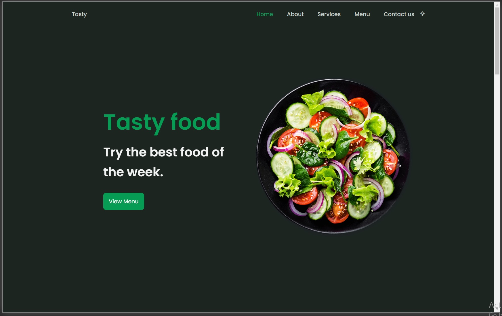

# Responsive Website Restaurant
## 
### Responsive Website For Restaurant
Copied design of a responsive restaurant website from some template 🥗 . It contains a header, home, about, services, menu, app, contact and a footer. It also has a fully developed light/dark mode 🌓.
Mobile First Design.
Using ScrollReveal Js.
Sass with live sass compiler extension.

.

